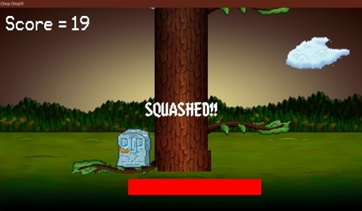

# ChopChop
It is a simple game developed using C++, and SFML (Simple and Fast Multimedia Library) Graphics library.

## Downlaod Link for final build:
Link: [Download](https://bit.ly/complex_problem)

## Images of Build version:
### Start View:

### Game Play:

### Out of Time

### Death View:

## Developers: 
  * Harsh Bhardwaj
  * Jayanti Tomar
  * Garvit Rangi
